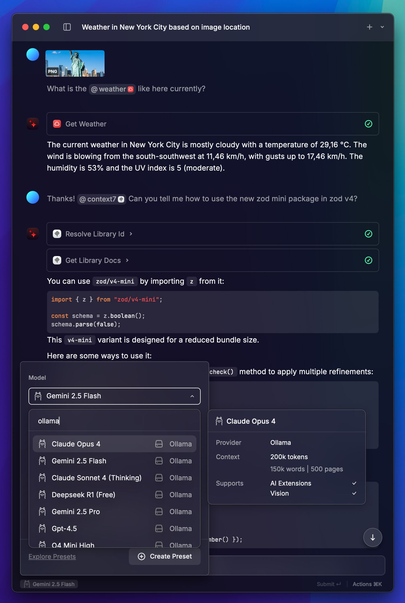
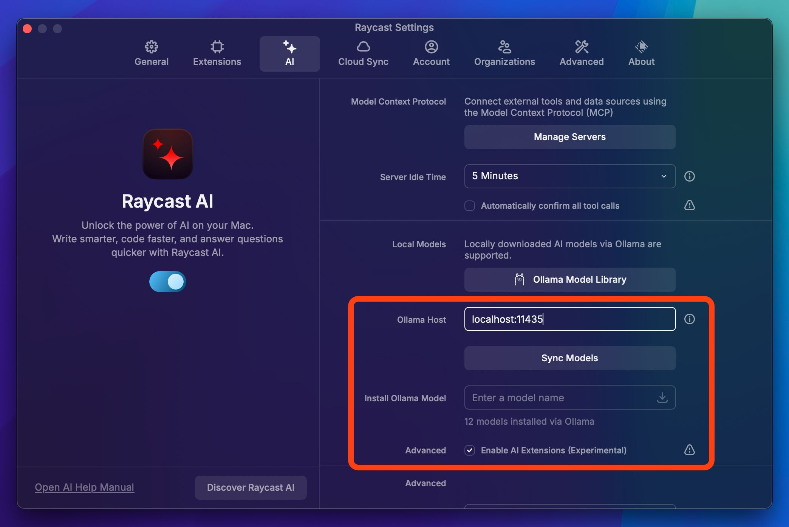

# Raycast AI OpenRouter Proxy

This project provides a proxy server that allows Raycast AI to utilize any model available on OpenRouter. This brings "Bring Your Own Key" (BYOK) functionality to Raycast AI, meaning you can use your OpenRouter API key and models.

**No Raycast Pro subscription required!** 🎉

This proxy allows using OpenRouter models inside Raycast, including **AI Chat**, **AI Commands**, **Quick AI**, and **AI Presets**, giving you Raycast's native AI experience with the flexibility of OpenRouter models and your own API key.

> [!WARNING]
>
> **Work In Progress**: This project is still in development. While it works well for many use cases, there may be bugs and possible issues. Use with caution.



## Features

This proxy aims to provide a seamless experience for using OpenRouter models within Raycast. Here's what is supported and what is not:

### Supported:

- 🧠 **Any OpenRouter model**: Access the wide range of models offered by OpenRouter.
- 👀 **Vision support**: Use models capable of processing images.
- 🛠️ **AI Extensions & MCP**: Use your favorite AI Extensions and MCP servers. Note that Ollama tool calling support is experimental in Raycast.
- 📝 **System instructions**: Provide system-level prompts to guide model behavior.
- 📎 **Attachments**: Attach all the same things as with the official models.
- 🔨 **Parallel tool use**: Make multiple tool calls simultaneously.
- ⚡ **Streaming**: Get real-time responses from models.
- 🔤 **Chat title generation**: Automatically generate chat titles.
- 🛑 **Stream cancellation**: Stop ongoing responses from models.

### Not Supported:

- 💭 **Displaying thinking process**: Models do not display their thinking process, but thinking models are supported.
- 🌐 **Remote tools**: Some AI Extensions are classified as "remote tools" and are not supported. These include `@web` and `@gpt_image`, among others. You can replace these with MCP servers if you would like similar tools.

## Requirements

- Docker
- OpenRouter API key

## Getting Started

To get started, follow these steps:

1. Clone the repository:

   ```bash
   git clone https://github.com/miikkaylisiurunen/raycast-ai-openrouter-proxy.git
   ```

2. Change into the project directory:

   ```bash
   cd raycast-ai-openrouter-proxy
   ```

3. Set your OpenRouter API key in the Docker Compose file. Open the `docker-compose.yml` file and replace `YOUR_OPENROUTER_API_KEY` with your actual OpenRouter API key.

4. Update the models configuration file. An example `models.json` file is included in the project root for configuring models. Refer to the [Configuration](#configuration) section for details on its structure.

5. Start the proxy server:

   ```bash
   docker compose up -d
   ```

   This will start the proxy server in the background. By default, it will run on port `11435`. If that port is already in use, you can change it in the `docker-compose.yml` file.

6. Set the Ollama host in Raycast settings: Open Raycast Settings, go to AI > Ollama Host and set the host to `localhost:11435`. If you changed the port in the `docker-compose.yml` file, make sure to update it here as well. You can also enable experimental AI Extension and MCP support in the Raycast settings. See the [Configuration](#configuration) section for more details.

   

## Configuration

The proxy's behavior is primarily configured through a `models.json` file in the root directory of the project. This file defines the models available to Raycast and their specific settings. An example `models.json` file is included in this repository. Each entry in the JSON array represents a model and can include the following properties:

- `name`: The name of the model as it will appear in Raycast.
- `id`: The OpenRouter model ID. This is the identifier OpenRouter uses for the model.
- `contextLength`: The maximum context length (in tokens) the model supports. Only affects Raycast's UI and not the model itself.
- `capabilities`: An array of strings indicating the model's capabilities.
  - `"vision"`: The model can process images.
  - `"tools"`: The model supports AI Extensions and MCP (tool calling). You need to enable the experimental AI Extensions support in Raycast settings for this to work.
- `temperature`: (Optional) Controls the creativity of the model. A value between 0 and 2.
- `topP`: (Optional) Another parameter to control the randomness of the output, a value between 0 and 1.
- `max_tokens`: (Optional) The maximum number of tokens the model is allowed to generate in a single response.
- `extra`: (Optional) An object for advanced, OpenRouter-specific configurations. These options are passed directly to the OpenRouter API. For example, you can specify a preferred provider (`"provider": { "only": ["openai"] }`) or set the reasoning effort (`"reasoning": { "effort": "high" }`). Refer to the OpenRouter documentation for available parameters. Note that `extra` properties are not validated at startup. If you encounter issues, check the container logs after sending a request for any errors related to these settings.

When you modify the `models.json` file, you need to restart the proxy server for the changes to take effect. You can do this by running:

```bash
docker compose restart
```

Example `models.json` structure:

```json
[
  {
    "name": "Gemini 2.5 Flash",
    "id": "google/gemini-2.5-flash-preview-05-20",
    "contextLength": 1000000,
    "capabilities": ["vision", "tools"],
    "temperature": 0
  },
  {
    "name": "Gemini 2.5 Flash Thinking",
    "id": "google/gemini-2.5-flash-preview-05-20:thinking",
    "contextLength": 1000000,
    "capabilities": ["vision", "tools"],
    "temperature": 1
  },
  {
    "name": "GPT-4o Mini",
    "id": "openai/gpt-4o-mini",
    "contextLength": 128000,
    "capabilities": ["vision", "tools"]
  },
  {
    "name": "Claude Sonnet 4 (Thinking)",
    "id": "anthropic/claude-sonnet-4",
    "contextLength": 200000,
    "capabilities": ["vision", "tools"],
    "temperature": 0.7,
    "extra": {
      "reasoning": {
        "max_tokens": 4000
      }
    }
  }
]
```

## FAQ

### What works/does not work?

Refer to the [Features](#features) section for a list of supported and unsupported functionalities.

### Is a Raycast Pro subscription required to use this?

No, one of the main benefits of this proxy is to enable the use of OpenRouter models within Raycast without needing a Raycast Pro subscription.

### Can I deploy this on a remote server?

Yes, but it is generally not recommended. There is currently no authentication implemented, meaning anyone with access to your server's address could potentially make requests using your OpenRouter API key. You would need to implement your own authentication mechanism if you want to secure it for remote access.

### Do I need to install Ollama?

No, you do not need to install Ollama.

### How do I configure Raycast to use this proxy?

See the [Getting Started](#getting-started) section.

### How does this work?

This proxy acts as an Ollama server, allowing Raycast to communicate with it. It translates requests from Raycast into a format that OpenRouter understands.

### I updated the model configuration, but it doesn't seem to take effect. What should I do?

If you modify the `models.json` file, you need to restart the proxy server for the changes to take effect. You can do this by running:

```bash
docker compose restart
```

### What if something doesn't work?

If you encounter issues, a good first step is to check the container logs. You can do this by running the command:

```bash
docker compose logs
```
